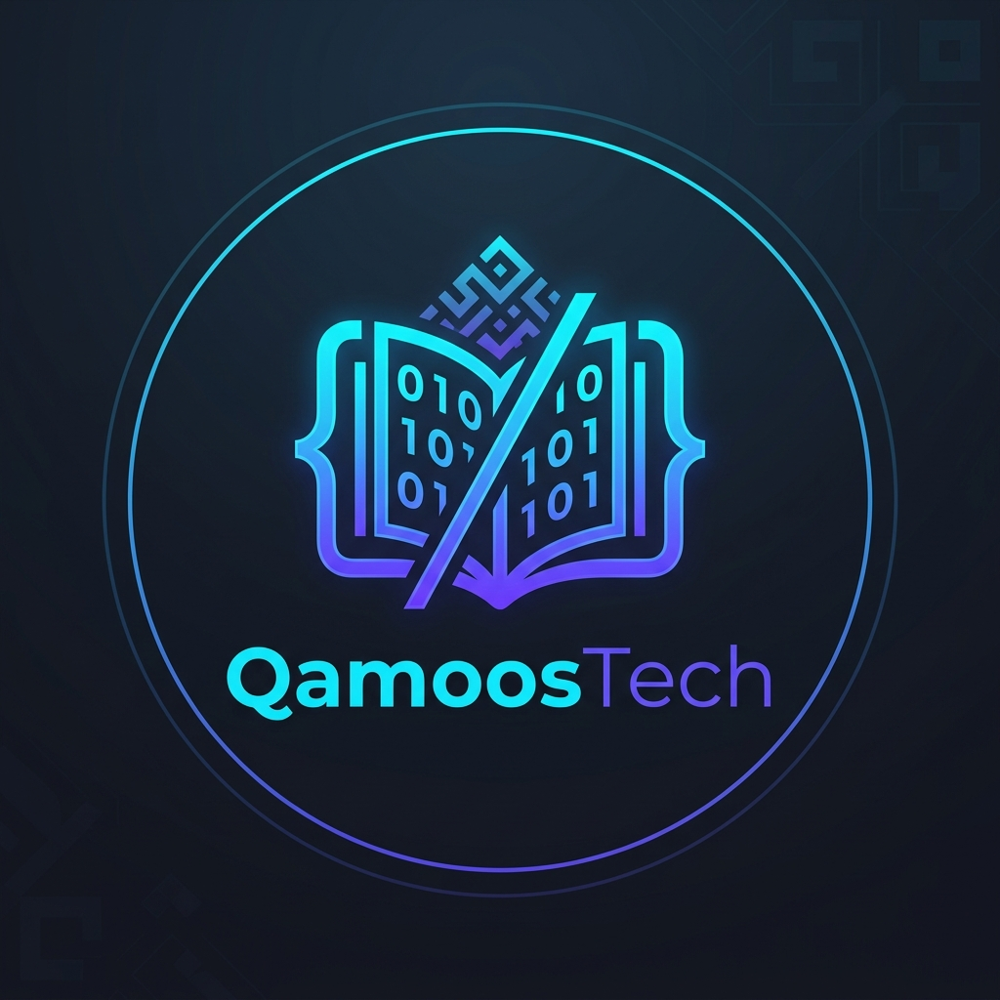

<div align="center">
  
  <h1>QamoosTech (قاموس تك)</h1>
</div>

> A personal knowledge base for mastering technical English and professional communication — built by a backend engineer, for engineers.

## 📊 Stats

| Section | Files | Entries |
|---|---|---|
| Technical Engineering | 8 | 25+ |
| Professional Communication | 4 | 18+ |
| General English | 3 | 15+ |
| **Total** | **15** | **58+** |

## 📁 Structure

```
01-Technical-Engineering/    Technical concepts, architectures, and stacks
├── Backend/                 APIs, architecture, security, infrastructure, Git
├── Frontend/                UI/UX, frameworks, patterns
├── AI-and-Data/             LLMs, OCR, pipelines, data engineering
└── Languages/               Python, TypeScript, Go idioms

02-Professional-Communication/   Workplace communication and soft skills
├── Emails/                  Templates, action verbs, high-impact phrases
└── Conversations/           Meetings, Agile, negotiations

03-General-English/          Broader language improvement
├── idioms-and-phrases.md    Common English idioms
├── phrasal-verbs.md         Phrasal verbs for tech contexts
└── technical-slang.md       Developer slang and jargon
```

## 📝 Entry Format

Every entry follows a consistent template for maximum learning value:

```markdown
### Term or Phrase
- **Pronunciation**: "HEW-mun REE-duh-bul" · هيومن ريدابل
- **Arabic**: الترجمة العربية
- **Definition**: Clear, concise explanation.
- **Context**: Where you'd encounter or use this.
- **Usage Examples**:
  - *Formal*: "..."
  - *Casual*: "..."
- **Common Mistake**: What people get wrong.
- **Related Terms**: [Term], [Term]
```

## 🚀 How to Use

1. **Encounter a new word** in your daily work (Slack, email, code review, meeting).
2. **Open the right file** based on the category.
3. **Add the entry** using the template above.
4. **Review periodically** — skim a file before a meeting or interview for instant confidence.

## 📄 License

Personal knowledge base. Feel free to fork and adapt for your own learning journey.
